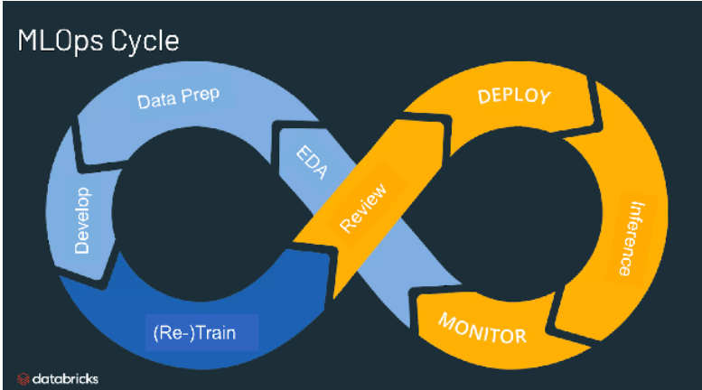

Les **MLOps** (Machine Learning Operations) désignent l'**ensemble des pratiques et des outils** permettant de **déployer**, **surveiller** et **maintenir** les modèles de machine learning en production. C'est une approche inspirée des principes DevOps, adaptée aux spécificités des projets ML.  

L'objectif des MLOps est d'accélérer et maintenir le **cycle de vie** des modèles tout en garantissant leur qualité, leur traçabilité et leur robustesse en production. Les MLOps favorisent la collaboration entre les équipes data science, data engineering et IT. L'objectif est aussi d'**automatiser** au maximum les étapes critiques du déploiement.  

Un **pipeline** MLOps typique couvre l'ensemble des étapes, depuis l'exploration et la préparation des données jusqu'à l'entraînement des modeles, leur validation, leur mise en production et leur supervision. La gestion des versions des modèles, la reproductibilité des expériences et l'automatisation des déploiements font partie intégrante de cette démarche. Le monitoring en production est essentiel pour détecter les dérives de données ou de performance, déclenchant si besoin des réentraînements automatiques. Enfin, sous forme de **cycle**, une pipeline MLOps typique doit en cas nécessaire nécessiter un nouveau project ML (Data Prep, EDA, Model, etc.)

Parmi les bénéfices majeurs des MLOps, on retrouve l'**efficacité opérationnelle**, la capacité à gérer des modèles à grande échelle et la réduction des risques liés à la qualité et à la conformité des modèles. L’adoption des MLOps permet de passer plus rapidement de la phase de recherche à la mise en production tout en assurant un meilleur contrôle. Le MLOps offre également du **contrôle et de l'alerting**, indispensable dans certains secteurs.  
